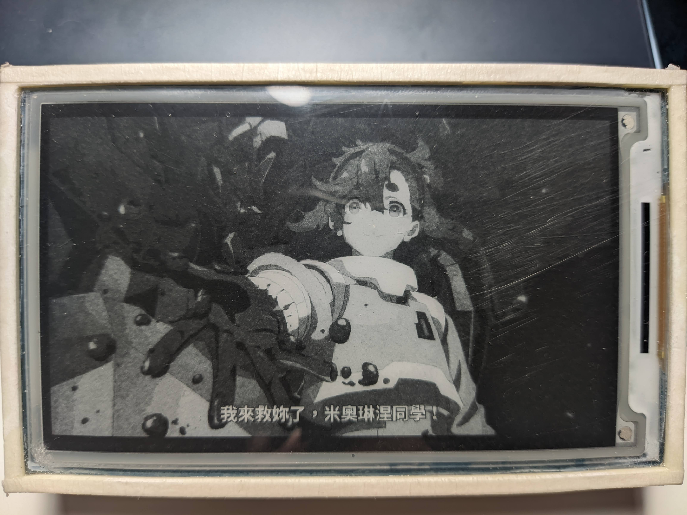
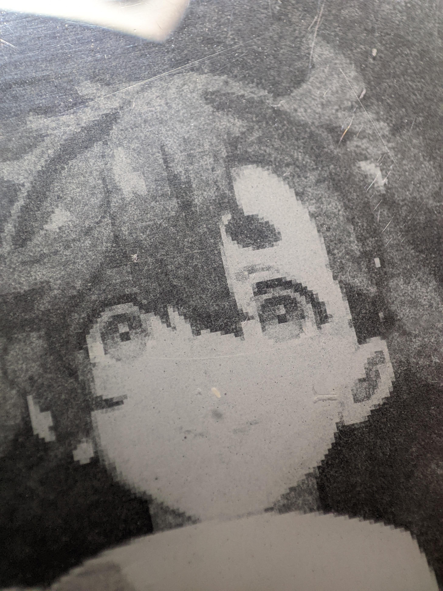
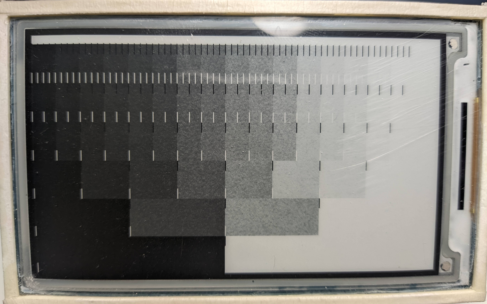
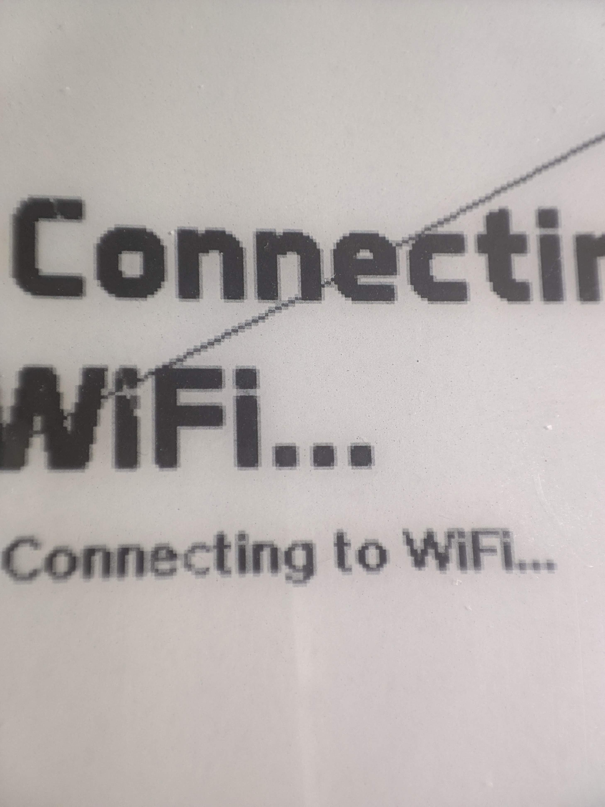
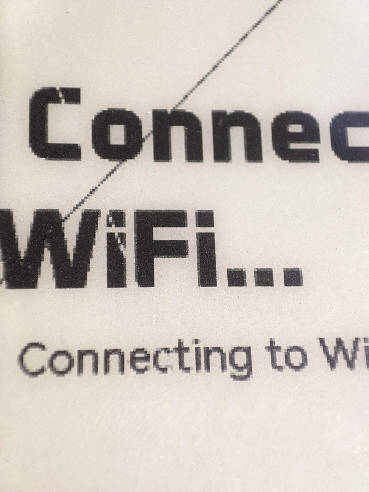
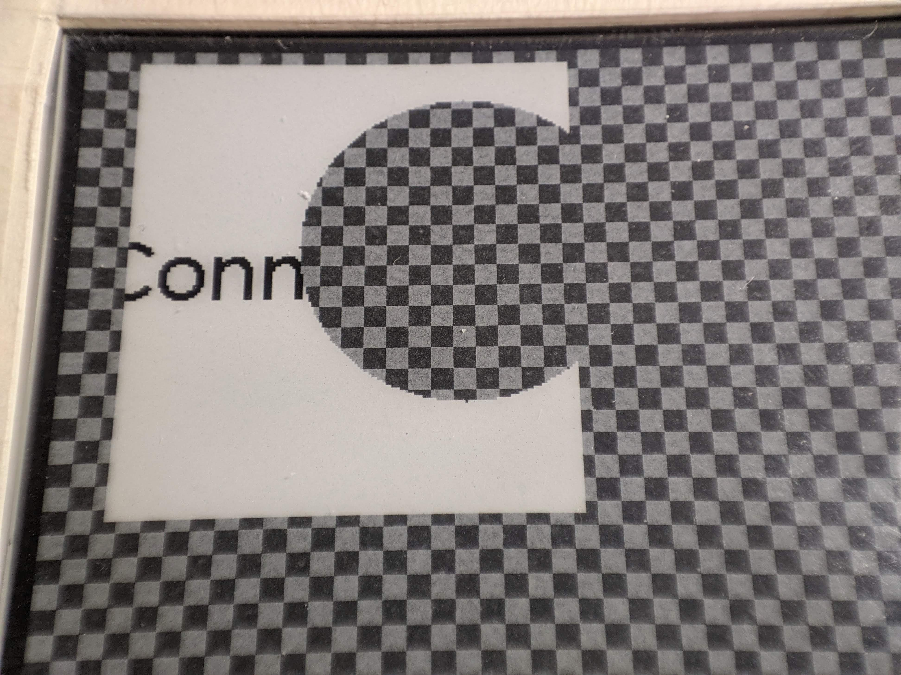

# Epepd

An **eP**aper **d**isplay library with **e**ndless **p**ossibilities\
_currently only supports Waveshare 3.7" ePaper HAT_

## What can it do?

Like... draw stuff in 480*280 hIgH rEsOlUtIoN 4-bit 16 color wIdE cOlOr gAMut on your 4-shades-of-grey-capable ePaper display?





`source: MS Gundam - The Witch from Mercury`

---

This library is not done, and so does this README. It's a mess, and information may be incorrect.

### 16 shades of grey



This is drawn with the `EpGreyscaleDisplay` function with the display mode `GC16`. It uses 3 update cycles to create 64 different "brightening" durations after wiping the screen black. Then from which 16 colors that most represents a greyscale are picked (manually, by eye). It can technically be done in 2 display cycles, but due to the nature of the ePaper chemistry (idk), "brightening" one unit of time from black will create a far bigger brightness difference than the difference between 62 units and 63 units. 

```cpp
const uint8_t EpGreyscaleDisplay::lut_64_to_16[] = {0, 1, 2, 3, 4, 5, 7, 9, 11, 13, 15, 23, 27, 31, 53, 63};
```

This is the lookup table I ended up using. dYou might see why doing in 2 cycles won't work as well as this does.\
Also, since the black capsules are "barely below white" through this process, after a few display updates, the blacks tend to fade away (not that much though, don't worry, and it is after 40 partial updates). Even though I set VCOM voltage to 0 (so DCVCOM = VSS, so no voltage difference at all), it still does that. Starting from grey and do brightening and darkening at the same time is another option. The video below is done this way in 2 display cycles. But this method does not guarantee strictly increasing brightness, especially that the environment temperature can quite heavily affect the display, I think this is a better option.

### More shades of grey? How about partial display? Same time?

Partial update with masks is also implemented. Here's a demo:

https://user-images.githubusercontent.com/39593345/213897907-6412e682-08c0-4cbb-b81f-d64d4be2cc42.mp4

(Converted oversize video with VLC, came out stretched, whatever)

```cpp
{ /// draw greyscale background
    // clear screen
    EpPartialDisplay partialDisplay(epd);
    gfxBuffer.fillScreen(GFX_WHITE);
    partialDisplay.display(&gfxBuffer, EpPartialDisplay::DU2);

    // draw rectangles
    uint16_t colorCodes[4][16] = {
            {0b00000000, 0b11111111},
            {0b00000000, 0b01010101, 0b10101010, 0b11111111},
            {0b00000000, 0b00100100, 0b01001001, 0b01101101, 0b10010010, 0b10110110, 0b11011011, 0b11111111},
            {0b00000000, 0b00010001, 0b00100010, 0b00110011, 0b01000100, 0b01010101, 0b01100110, 0b01110111,
                    0b10001000, 0b10011001, 0b10101010, 0b10111011, 0b11001100, 0b11011101, 0b11101110, 0b11111111}
    };
    for (int bit = 1; bit <= 4; bit++)
        for (int seg = 0; seg < (1 << bit); seg++)
            gfxBuffer.fillRect((bit - 1) * (epd.EPD_WIDTH / 4), seg * (epd.EPD_HEIGHT / (1 << bit)), epd.EPD_WIDTH / depth, epd.EPD_HEIGHT / (1 << bit), colorCodes[bit - 1][seg] << 3);

    // draw image using greyscaleDisplay
    EpGreyscaleDisplay greyscaleDisplay(epd);
    greyscaleDisplay.display(&gfxBuffer, EpGreyscaleDisplay::GC16); // greyscale clear 16
}
delay(1000);
{ /// draw overlay menu with partial display
    // create a mask for partial display
    EpBitmapFast updateMask(280, 480, 1);
    updateMask.setBitmapShapeBlendMode(EpBitmapFast::SHAPES_ONLY); // use shapes mode to save memory space instead of bitmap
    updateMask.setRectangle(10, 40, 200, 400, 0xFF, EpShape::ADD);

    const char* str[20] = { // Clion File menu
            "New",
            "Open...",
            ...
            "Exit"
    };
    gfxBuffer.fillRect(10, 40, 200, 400, GFX_WHITE);
    int highlightedItem = 0;

    EpPartialDisplay partialDisplay(epd);
    gfxBuffer.fillRect(10, 40, 200, 400, GFX_WHITE);

    // draw menu
    gfxBuffer.setFont(&HarmonyOS_Sans_Medium8pt7b);
    for (int f = 0; f < 20; f++) {
        highlightedItem = f;
        for (int i = 0; i < 20; i++) {
            const int margin = 2, itemHeight = 18;
            gfxBuffer.fillRect(10 + margin, 40 + margin + itemHeight * i, 200 - 2 * margin, itemHeight - 2 * margin, (highlightedItem == i) ? GFX_BLACK : GFX_WHITE);
            gfxBuffer.setTextColor((highlightedItem == i) ? GFX_WHITE : GFX_BLACK);
            gfxBuffer.setCursor(10 + margin + 4, 40 + margin + itemHeight * i + 11);
            gfxBuffer.print(str[i]);
        }
        // parameters: source image, display mode (A2 for animation), partial display mask, force update mask (first draw will be force update)
        partialDisplay.display(&gfxBuffer, EpPartialDisplay::A2, &updateMask, (f == 0) ? &updateMask : nullptr);
    }
}
```

You may or may not have found out that... it's slow. There is no delay for each `int f` iteration.\
Well... I'll try to optimize it. Getting pixels from EpBitmaps is way too slow (each call about 1us, but there are 280*480=134,400 pixels...)

Update: Well actually it isn't *that* slow, this is just from processing that many pixels one by one.

Here are the benchmarks for processing a whole frame:

```
134400 gfxBuffer.getPixel calls                took  77668us, 0.577917us/call (like reading from a 4bpp image) 
134400 epepd.getBwRam()->getPixel calls        took  78746us, 0.585915us/call (like reading from a 1bpp image)
 16800 epepd.getBwRam()->_streamOutBytes calls took   3061us, 0.182262us/call (like reading old frame data)
 16800 epepd.getBwRam()->_streamInBytes calls  took   3057us, 0.182024us/call (like writing display frame data)
134400 gfxBuffer.drawPixel calls               took  98549us, 0.733281us/call (like Adafruit_GFX fillScreen, unoptimized)
134400 GFXcanvas1.getPixel calls               took  54512us, 0.405603us/call (to see how Adafruit performs)
134400 GFXcanvas1.drawPixel calls              took 107966us, 0.803318us/call (to see how Adafruit performs)
134400 GFXcanvas8.getPixel calls               took  41009us, 0.305164us/call (to see how Adafruit performs)
134400 GFXcanvas8.drawPixel calls              took  70193us, 0.522299us/call (to see how Adafruit performs)
```

Considering Adafruit_GFX doesn't split the buffer into chunks (not even one 8 bit full frame buffer will fit in memory, on boot my ESP32 only has a largest
block of only 113792 bytes long, and there are no 2 bit options, or 3, or 4...),
I think I'm actually doing fine. At least I'm now sure that I'm not a whole magnitude slower or something. I thought the ESP32 were faster than this though,
disappointing...

So the next goal will be to optimize by lowering pixel count, by supporting windowed update.

Another update:\
I realized I can't even write to the display while it is still updating.

```
[epepd] EpPartialDisplay calculate lut took 156320us (meanwhile display is still updating)
[epepd] EpGreyscaleDisplay waited 350668us while display updating (still not done)
[epepd] Init display took 137us (finally done, now I can send commands)
[epepd] Write LUT took 112us
[epepd] Sending two sets of display buffer took 35385us (reducing this is the only hope of increasing update rates)
[epepd] Display update took 28us (just a command, nothing updated yet)
```

So although I *did* waste a whole 160ms on writing to the buffer on the ESP32 and have to spend another 36ms sending it to the display, I still can't
refresh the screen any faster. The time spent updating (for the current A2 lut) is 156ms + 350ms = about half a second.\
Of course, any optimization in the "epepd function" part leaves more time for Adafruit_GFX drawing, data processing, etc.

Another update:\
You can now determine an update region from Adafruit_GFX functions and then pass it to the display function. For the example above, the update time is down to
18ms!
Because finding out the bounds of "updated pixels" is not always simple, or require additional logic. Check the code below to see how easy it is to implement
windowed update!

```
[epepd] Updating region X from 8 to 208, Y from 114 to 147, that is 4% of a full frame!
[epepd] EpPartialDisplay calculate lut took 17237us
```

and the code change:

```cpp
partialDisplay.display(gfxBuffer, placement, EpPartialDisplay::A2, &updateMask, &updateMask, nullptr);

for (int f = 0; f < 20; f++) {
    highlightedItem = f;
    // clear previous
    gfxBuffer.gfxUpdatedRegion.reset(); // reset the "bounds of updated pixels" after displaying
    int i = previousHighlightedItem;
    gfxBuffer.fillRect(10 + margin, 40 + margin + itemHeight * i, 200 - 2 * margin, itemHeight - 2 * margin, GFX_WHITE);
    gfxBuffer.setTextColor(GFX_BLACK);
    gfxBuffer.setCursor(10 + margin + 4, 40 + margin + itemHeight * i + 11);
    gfxBuffer.print(str[i]);
    // highlight current
    i = highlightedItem;
    gfxBuffer.fillRect(10 + margin, 40 + margin + itemHeight * i, 200 - 2 * margin, itemHeight - 2 * margin, GFX_BLACK);
    gfxBuffer.setTextColor(GFX_WHITE);
    gfxBuffer.setCursor(10 + margin + 4, 40 + margin + itemHeight * i + 11);
    gfxBuffer.print(str[i]);
    // display (with windowed update)
    partialDisplay.display(gfxBuffer, placement, EpPartialDisplay::A2, &updateMask, nullptr, &gfxBuffer.gfxUpdatedRegion);
    // we did nothing extra, just calling gfx draw functions. the region where pixels has been updated (gfxUpdatedRegion) has been determined automatically
    previousHighlightedItem = highlightedItem;
}
```

### Anti-aliasing

Rough edges? With `getPixelLUT` custom transition function, you can send pixel data that are multisampled from neighbor pixels.



Yes, I know it looks terrible, especially that `c`... Although there's a white line that went through it.\
But all you need to do is...

```cpp
EpBitmap gfxBuffer(480, 280, 1); // set the Adafruit_GFX buffer
Epepd epd(gfxBuffer, EPAPER_CS, EPAPER_DC, EPAPER_RST, EPAPER_BUSY);

void setup() {
    epd.init();
    gfxBuffer.allocate(4096); // allocate the buffer in 4KB chunks so that it will fit in memory
    
    // start drawing
    epd.setTextColor(BLACK);
    epd.setCursor(10, 100);
    epd.print("Connecting to\nWiFi...");
    epd.setFont(&HarmonyOS_Sans_Medium8pt7b);
    epd.setCursor(10, 180);
    epd.print("Connecting to WiFi...");
    epd.drawLine(0, 150, 260, 9, BLACK);
    epd.drawLine(0, 10, 150, 425, WHITE);

    // display
    epd.display();
}
```

and for the display function override... _(the actual "plugin" style classes has not been implemented yet)_

```cpp
void Epepd::display() {
    initDisplay();
    
    writeToDisplay([](Epepd &epepd, int16_t originX, int16_t y) {
        int blackPixels = 0;
        for (int dx = -1; dx <= 1; dx++)
            for (int dy = -1; dy <= 1; dy++)
                if (epepd.gfxBuffer->getPixel(originX + dx, y + dy)) blackPixels++;
        const uint8_t defBlack[] = { LUT0, LUT0, LUT1, LUT1, LUT2, LUT2, LUT2, LUT2, LUT3, LUT3 };
        const uint8_t defWhite[] = { LUT0, LUT0, LUT0, LUT0, LUT0, LUT1, LUT1, LUT1, LUT2, LUT3 };
        // what LUT0-3 does depend on the LUT, which will be customizable too
        // in this case it is just a normal 4-shades-of-grey LUT
        return (epepd.gfxBuffer->getPixel(originX, y) ? defBlack[blackPixels] : defWhite[blackPixels]);
    });
    
    updateDisplay();
}
```

Now you have smooth lines and kinda smooth text, without special fonts or drawing functions, and the same memory usage!

### Supersampling

If you have plenty of RAM to spare, you can increase the `Adafruit_GFX` frame buffer resolution, and then use the `getPixelLUT` function to output an
appropriate level of grey for smooth fonts too (as GFXFonts don't do anti-aliased fonts, what about just supersample it?)



And all you need to do is...

```cpp
EpBitmap gfxBuffer(960, 560, 1); // set the Adafruit_GFX buffer oversized
Epepd epd(gfxBuffer, EPAPER_CS, EPAPER_DC, EPAPER_RST, EPAPER_BUSY);

void setup() {
    epd.init();
    gfxBuffer.allocate(4096); // allocate the buffer in 4KB chunks so that it will fit in memory
    
    // start drawing, with everything doubled
    epd.setFont(&Aero_Matics_Bold44pt7b);
    epd.fillScreen(WHITE);
    epd.setTextColor(BLACK);
    epd.setCursor(20, 200);
    epd.print("Connecting to\nWiFi...");
    ...
    
    // display
    epd.display();
}
```

and for the display function override...

```cpp
void Epepd::display() {
    initDisplay();
    
    writeToDisplay([](Epepd &epepd, int16_t originX, int16_t y) {
        int blackPixels = 0;
        for (int dx = 0; dx <= 1; dx++)
            for (int dy = 0; dy <= 1; dy++)
                if (epepd.gfxBuffer->getPixel(originX * 2 + dx, y * 2 + dy)) blackPixels++;
        const uint8_t def[] = {LUT0, LUT1, LUT1, LUT2, LUT3};
        return def[blackPixels];
    });
    
    updateDisplay();
}
```

and that's it. That's pretty intuitive if I say so myself.

### Mixed display modes

What is stopping "4 shades of grey" and "partial update" from existing the same time? It is that there is only two sets of memory in the display controller. By
storing the states ourselves, we can make partial updaate work without wiping the drawn greyscale image using the powerful `getPixelLUT` function.

### Maybe 8 shades of grey? How about 16?

By switching LUTs within a display update routine, maybe, just maybe, we can display even more levels of grey. Although the displays that have way higher
resolutions and 16 levels of grey costs just 3 to 4 times more than this 3.7 inch display that is apparently not very popular.\
(The 4.3 inch one seems more
popular, especially the B/W/Red ones, but geez the red ones are barely usable with the painfully slow update speed and lack of *official* partial update
support)

### Blur? Dithering? Effects!

You get the point.

---

Basically, the library _will_ allow you to do just about anything technically possible. But I probably will only implement some that I need, so that's why it is
called the **Endless Possibility ePaper Display Library**, I'm just creating the framework, not implementing all kinds of dithering algorithms.

---

## Overpowered graphics buffer

Graphics buffer in almost all libraries only do one thing, to display. Because microcontrollers have limited memory, most only have one set, or even less with
paged drawing.\
To achieve the flexibility I want, I'd like multiple frame buffers to act like masks and textures. But our poor ESP32 have limited memory.

### Shapes mode

If you think about masks, they are usually just rectangles, maybe sometimes circles. Why not use those primitives as masks? If so, we can save tons of memory.
How about more complex shapes? What if in some occasion I want to use some logo as a partialUpdateMask? Therefore, I decided to combine shape masks and bitmaps,
so
the `EpFunction`s don't have to care about the type. The `EpBitmap` will handle both bitmaps and vector-ish shapes-based images.\
One rectangle or circle probably won't be enough for a partialUpdateMask, so it is now a list of shapes that will do
`ADD`, `SUBTRACT`, `INTERSECT`, `INTERSECT_USE_BEHIND` and `EXCLUDE` for you to build your complex shapes.

There are also multiple ways of combining the bitmap layer and the shapes layer.\
_(don't add too many shapes, under 10 it's basically unnoticeable, but a few hundreds will make rendering pretty slow)_

```cpp
enum BitmapShapeBlendMode {
    BITMAP_ONLY, SHAPES_ONLY,             //   if shape    | else
    BITMAP_ADD_SHAPES,                    //   shape       | bitmap
    BITMAP_SUBTRACT_SHAPES,               //   transparent | bitmap
    BITMAP_INTERSECT_SHAPES,              //   bitmap      | transparent
    //                      if bitmap != transparent color | else
    SHAPES_ADD_BITMAP,                    //   bitmap      | shape
    SHAPES_SUBTRACT_BITMAP,               //   transparent | shape
    SHAPES_INTERSECT_BITMAP,              //   shape       | transparent
};
```

Of course, it will be even more powerful if you could have multiple layers of shapes and bitmaps, but I don't think that is really needed. In fact, all
these `BitmapShapeBlendMode` aren't supposed to exist. Shapes mode exists only to build simple masks to feed to `EpFunction`s, it just went a bit out of
control...

Here's an example of a single `EpBitmap` doing... not much



```cpp
gfxBuffer.setTransparencyPattern(); // you can also pick a color
gfxBuffer.setBitmapShapeBlendMode(EpBitmap::BITMAP_INTERSECT_SHAPES); // keep bitmap where shape intersects
epd.fillScreen(WHITE); // the Mojang-logo-shaped area
epd.setTextColor(BLACK); // the "Conn" text
epd.setFont(&HarmonyOS_Sans_Medium16pt7b);
epd.setCursor(10, 100);
epd.print("Connecting to WiFi...");
gfxBuffer.setRectangle(20, 5, 160, 200, BLACK, EpShape::ADD);
gfxBuffer.setCircle(140, 80, 120, BLACK, EpShape::SUBTRACT); // order matters

epd.display();
```

### Space efficient

You want 3 bits per pixel for 8 shades of grey? With `EpBitmap` you can do that. It will also be saved into chunks, so it will fit in the available memory
spaces. Also, you can just save things in shapes mode, which will barely take up any space.

### EpBitmapMono

This is a variant that is optimized for 1 bit mono bitmaps. It is not necessarily faster than regular EpBitmap with _streamBytes *(these functions now
deprecated)*, but it is way more friendly to use those functions. It allocates a single 16800 byte chunk of memory though.

---

Here are the frame buffers needed for epepd:

```cpp
// the frame buffer for Adafruit_GFX functions
EpBitmap gfxBuffer(480, 280, 4); // if you want 16 grey levels (displaying over 4 is not supported yet)
EpBitmap gfxBuffer(960, 560, 1); // if you want to supersample or do some weird stuff with the other 3 frames

// the copy of display ram
// it's just 16.8KB each, I think these will be used fairly often by all kinds of EpFunctions, so reading back from the display is not really reasonable.
EpBitmap redRam(EPD_WIDTH, EPD_HEIGHT, 1); // LUT bit 1, previous (for partial)
EpBitmap bwRam(EPD_WIDTH, EPD_HEIGHT, 1);  // LUT bit 0, current (for partial)
```

Basically it's really convenient and flexible, if not a bit slow... _(currently getPixelLUT() takes a whopping 100+ms to run)_\
Maybe you can suggest how do I make it faster? It's just bit-packed arrays...

## Display support

To keep the development process fast, I didn't future-proof it with any display module selection code. It can be added later though. But it is certain that I
can't support a lot of displays, because each display will require its own LUT and tuning. I may make my classes compatible with Zingg's GxEPD2 library, but it
will still require you to have the knowledge to tinker and write your own LUT for support of other modules.

Also, this library is clearly not done. None of the features mentioned is implemented yet. This library can currently display 4 shades of grey.

## Microcontroller support

The whole library will be designed for the ESP32. Maybe Teensy 4.1.\
The balance of features and compromises is decided based on the ESP32, mainly DRAM related problems.

## References

- [Display driver datasheet](https://www.waveshare.com/w/upload/2/2a/SSD1677_1.0.pdf)
- [Waveshare wiki page](https://www.waveshare.com/wiki/3.7inch_e-Paper_HAT_Manual#Introduction)
- [Terrible code, but it works. GxEPD2 seems to have taken the display-module-specific stuff from here too](https://github.com/waveshare/e-Paper)
- [ZinggJM/GxEPD2](https://github.com/ZinggJM/GxEPD2)
- [ZinggJM/GxEPD2_4G](https://github.com/ZinggJM/GxEPD2_4G)
- [Definitions of display modes on high end epaper displays that I can't afford](https://www.waveshare.net/w/upload/c/c4/E-paper-mode-declaration.pdf)
- [Allocating Frame Buffer Memory 4KB At A Time](https://newscrewdriver.com/2021/05/21/allocating-frame-buffer-memory-4kb-at-a-time/)
- [ESP API that will make allocating tons of memory possible](https://docs.espressif.com/projects/esp-idf/en/latest/esp32/api-reference/system/mem_alloc.html#_CPPv432heap_caps_get_largest_free_block8uint32_t)
- [Helped me create the Suletta bloody hands bitmap](https://github.com/javl/image2cpp)